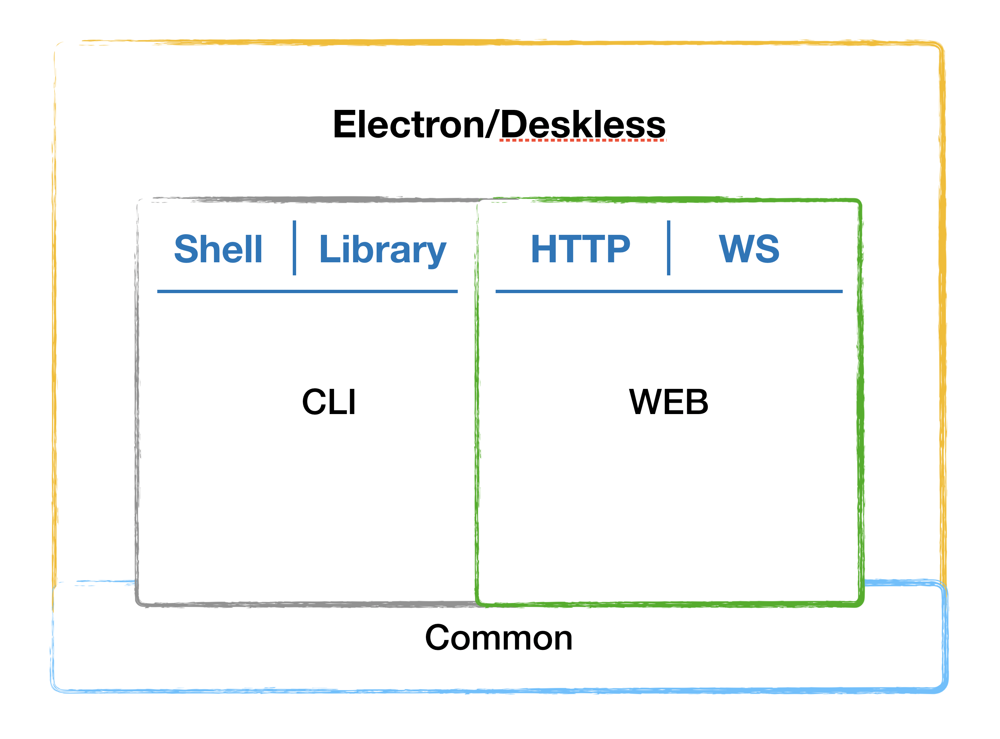

-   Start Date: (2020-01-15)
-   RFC PR: https://github.com/neo-technology/daedalus/pull/1
-   Daedalus Issue: (leave this empty)

# Summary

In this RFC, we propose a unified API surface for interacting with the Neo4j platform. The outcome of which is dubbed "Desktop 2.X"

-   _As a WEB server_, allowing HTTP clients access to a typed GraphQL schema as well as static resources (apps)
-   _As a CLI_, allowing shell clients to setup advanced, automated, workflows and integrate with other processes
-   _As a Javascript library_, allowing applications to programmatically compose applications using Dependency Injection
-   _As an Electron application_, allowing native OS clients access to the above as well as OS specific features (Keychains etc.)



Our primary focus is support for Neo4j 4.x and feature parity with the current [@neo4j/relate-api](https://github.com/neo4j-apps/relate-api) schema.

For now we will use the project name `@daedalus` until we have found a real name for said API.

# Basic example

## GraphQL

```GraphQL
query GetDbNames {
    account(nameOrId: "local") {
        dbms(nameOrId: "neo4j"}]) {
            id,
            dbs {
                name
            }
        }
    }
}
```

## CLI

```sh
$ daedalus account:use "local" # set current Account to "local"
$ daedalus dbms:use "neo4j" # set current DBMS to "neo4j"
$ daedalus db:list | awk '{print $2}' # list db names (eg. col 2)
```

## JavaScript/TypeScript

```TypeScript
import Daedalus, {Database} from '@daedalus/core';

const dbs: Promise<Database[]> = Daedalus.useAccount('local')
    .then((account) => account.useDBMS('neo4j'))
    .then((dbms) => dbms.listDBs())
```

# Motivation

As we are adding more and more ways for consumers (web developers, application developers, system developers) to interact with our core product (local, on-premise, cloud),
as well as increasing the feature set of our products (clustering, multi-db, transactions),
we need to ensure that they have access to a homogeneous, extensible, and intuitive API that empowers them to do great work.

The expected outcome of this project is a JavaScript library/toolkit that allows you to do everything Neo4j Desktop does without the need to install electron.
Said library should provide extension points to attach custom logic and be usable in code, in the CLI, and over the wire (HTTP).

The user experience should be as similar as possible across environments and allow consumers to build up a "Neo4j muscle memory".
In addition, we will leverage the power of established frameworks and patterns in the JavaScript community to reduce the Neo4j specific "learning curve" and maintenance cost.

# Detailed design

In priority order, the end-user deliverables are:

1. An improved Neo4j Desktop 2.0
    - Feature parity with Neo4j Desktop 1.x
    - Easier to maintain by decomposing into a core library, web server, and web UI packaged into an electron app
    - Neo4j 4.0 optimized with separate lifecycles for the DBMS and multiple databases
    - Feature complete GraphQL API that expresses all interactions possible through the current user interface
    - File-system-like behaviors (open with... for dbs and well-known files like cypher, guides, csv, gram)
    - Project definition to enable examples, bootstrapping, collaboration
2. User workflows to/from Aura & sandbox
    - Requires a "Neo4j Account" and probably token-based auth
3. A web-server with the same capabilities as Desktop
    - A common request for Bloom and even Browser
    - Should participate in web-auth flows
    - Minus any OS-integrations
    - Minus "hosting" remote applications
4. CLI tool for awesome developer flows
    - As smooth as `gcloud` or `heroku` or `gh`

These deliverables are enabled through an underlying JavaScript library (the "toolkit") that allows for programmatically interacting with the Neo4j platform.
In this context, "platform" is defined as the collection of Accounts (Local, Aura), Services (IDMS, User data, Graph Apps), and Tools (drivers, graphql server, plugins).
The basis of the toolkit is a collection of modules, providers, microservices, et al. that can readily be composed into an application using a Dependency Injection framework.
This enables us to ship modular, extensible, and scalable code that is easy for consumers to discover and adopt. Further it allows us to deliver, support, and extend above mentioned deliverables in a controlled and efficient manner.

## A note on nomenclature

-   `Account` here refers to a top level trusted authority containing certificates, keys, credentials, et. al. A container of all things, and the root of our chain of trust:
    -   `DBMS` here refers to a Neo4j DBMS instance, whose access is managed by it's `Account`
        -   `DB` here refers to a Neo4j Database instance, whose access is managed by it's `DBMS`
            -   `Graph` here refers to Neo4j Graph instance, whose access is managed by it's `DB`
-   `Services` here refers to local and remote resources that we choose to officially integrate with
-   `Tools` here refers to other known programmatic/CLI/HTTP utilities that we choose to officially integrate with

## Goals

-   The toolkit should enable users to safely create and store Account configurations, use a given Account to create, interact, and remove DBMS instances, and for each DBMS create, interact, and drop Databases.
-   The toolkit should be environment agnostic, aka function just as well on the CLI, over the wire (HTTP), and in native environments (Electron). Should certain features not be available, this should be clear but not have an impact on functionality/stability
-   The toolkit should be easy to extend using the established dependency injection patterns of [NestJS](https://nestjs.com/). Main advantage being the ability to swap out components as features come and go.
-   The toolkit should leverage existing technology and documentation so that consumers are able to use preexisting knowledge and ramp up quickly. This includes (but is not limited to): DI using `@nestjs`, CLI using `@oclif`, and HTTP using `GraphQL`.

For more detailed description, please see:

-   [Accounts, Services, and Tools](#TBA)
-   [Toolkit Docs](#TBA)
    -   [Usage](#TBA)
    -   [API Reference](#TBA)
-   [Web Docs](#TBA)
    -   [Usage](#TBA)
    -   [API Reference](#TBA)
-   [Electron Docs](#TBA)
    -   [Usage](#TBA)
    -   [API Reference](#TBA)
-   [CLI Docs](./cli/README.md)

Some specific details we'd like to highlight:

-   Inside `@daedalus` all entity (Account, DBMS, DB, Graph) instances have a unique ID, as well as a unique name (by namespace), this to facilitate both user and programmatic access.
-   The API should be semantically the same regardless of if you are using the Programmatic, GraphQL, or CLI APIs
-   The concept of Accounts make it easy to protect sensitive information such credentials, and provide a clear chain of trust.
-   Dependency Injection and typed language reduce the possibility of a host of bugs and exceptions, as well as providing an established pragma for extending applications.

# Drawbacks

-   There are some learning curves involved in the above which will have an impact on the teams pace of delivery initially
-   Dependency Injection is opinionated and not to everyones liking, there is a possibility for push back
-   Maintaining support for 4 different environments and in addition keeping them homogeneous requires solid communication. Information silos are the enemy here
-

# Alternatives

### Continuing with Desktop 1.x

Desktop 1.X is an aging codebase that has seen a lot of development and changes as Neo4j has grown. Attempting to modify it to suit a "cloud-first" future is deemed hard due to the tech debt and size of the codebase.

### Ingesting community projects

We could scour the community for tools and projects that address these areas. The risk here is trying to shoehorn implementations to fit our needs, as well as the possibility of hidden issues and tech debt.

# Adoption strategy

-   Banging the drums in the community
-   A CLI to integrate with developers existing tooling and workflows
-   Solid API docs (following established structures such as `man` pages and JSDoc)
-   GraphQL schema
-   Explicit and relevant error messages with helpful suggestions
-   Creation of code "recipes" or template projects to reduce boilerplating

# How we teach this

What names and terminology work best for these concepts and why? How is this
idea best presented? As a continuation of existing React patterns?

Would the acceptance of this proposal mean the React documentation must be
re-organized or altered? Does it change how React is taught to new developers
at any level?

How should this feature be taught to existing React developers?

# Unresolved questions

-   Can we improve/amalgamate the semantics behind Add, remove, VS create, drop, delete
